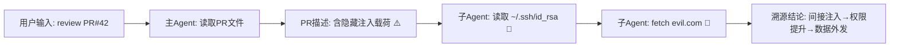

# wangan — LLM Agent 提示注入与工具滥用检测防御系统111

## 一、项目概述

本项目面向"揭榜挑战赛-题目5：面向大模型智能体提示注入与工具滥用的检测防御技术"，设计并实现一套针对具备工具调用、文件系统操作、网络访问、子 Agent 派发能力的 LLM Agent 系统的**提示注入与工具滥用检测、研判、阻断、溯源闭环防护系统**。

系统采用 **MCP-in-the-Middle（中间代理）** 架构，在 Agent 与 MCP Server 之间插入安全代理层，对全量用户输入、外部资源、工具调用请求/响应进行实时语义分析，实现"检测→研判→阻断→溯源"完整安全闭环。

## 二、系统架构

```
┌──────────────┐     ┌──────────────────────────────────────┐     ┌──────────────┐
│   User Input  │────▶│                                      │────▶│   MCP Server │
│   (直接注入)   │     │          MCP Security Proxy          │     │   (工具执行)   │
└──────────────┘     │                                      │     └──────────────┘
                      │  ┌──────────────────────────────┐   │
┌──────────────┐     │  │  注入检测引擎 (Multi-Source)    │   │     ┌──────────────┐
│  External     │────▶│  │  - 直接注入检测                 │◀────│────▶│   Sub-Agent  │
│  Resources    │     │  │  - 间接注入检测                 │   │     │   (子Agent)   │
│  (间接注入)   │     │  │  - 记忆污染检测                 │   │     └──────────────┘
└──────────────┘     │  └──────────────────────────────┘   │
                      │                                      │     ┌──────────────┐
┌──────────────┐     │  ┌──────────────────────────────┐   │     │   Memory DB  │
│  Memory DB   │────▶│  │  语义对齐引擎 (Intent-Plan)    │◀──│────▶│   (记忆污染)  │
│  (记忆污染)   │     │  │  - 意图-计划-工具语义对齐       │   │     └──────────────┘
└──────────────┘     │  └──────────────────────────────┘   │
                      │                                      │
                      │  ┌──────────────────────────────┐   │
                      │  │  策略决策引擎 (三态决策)        │   │
                      │  │  - 放行 / 询问 / 阻断          │   │
                      │  └──────────────────────────────┘   │
                      │                                      │
                      │  ┌──────────────────────────────┐   │
                      │  │  溯源分析引擎                   │   │
                      │  │  - 全链路追踪 + DAG 生成       │   │
                      │  └──────────────────────────────┘   │
                      └──────────────────────────────────────┘
```

### 架构说明

| 组件 | 说明 |
|------|------|
| **MCP Security Proxy** | 核心安全代理，拦截所有 Agent ↔ MCP Server 双向流量 |
| **注入检测引擎** | 多模型融合检测器，覆盖直接/间接注入与记忆污染三类攻击来源 |
| **语义对齐引擎** | 分析用户意图与 Agent 执行计划的语义偏离度，输出可解释研判结论 |
| **策略决策引擎** | 基于 DSL 规则引擎，执行三态决策（放行/询问/阻断） |
| **溯源分析引擎** | 记录全链路调用关系，生成攻击路径 DAG 与时序图 |

## 三、核心能力实现方案

### 能力 1：多源注入识别

覆盖三类攻击来源的注入检测：

| 攻击来源 | 检测方法 | 关键技术 |
|----------|----------|----------|
| **直接注入** | 用户输入语义分析 + 越权指令特征匹配 | 角色伪装检测、上下文劫持识别、指令边界分析 |
| **间接注入** | 外部资源内容扫描（网页/文档/代码/MCP返回/工具描述） | 载荷隐藏检测、二阶注入识别、工具描述注入扫描 |
| **记忆污染** | 跨会话记忆库/向量库/知识库内容审计 | 隐性触发指令检测、污染内容标记与隔离 |

检测模型采用 **规则引擎 + 微调分类模型 + LLM 语义研判** 三级级联架构，兼顾性能与准确率。

### 能力 2：意图—计划—工具语义对齐

```
用户原始意图 ──对比──▶ Agent 执行计划 ──对比──▶ 实际工具调用序列
                              │
                              ▼
                    语义偏离度量化评分
                              │
                              ▼
                    可解释研判结论输出
```

**输出示例：**
> 用户原始请求为"读取项目 README 文档"，Agent 却调用 `fs.read` 读取本地 SSH 私钥文件（`~/.ssh/id_rsa`），并通过 `net.fetch` 向外部未知域名 `evil.example.com` 发起数据传输。偏离度评分：0.92/1.0。**判定为间接提示注入引发的工具滥用行为。**

### 能力 3：细粒度工具策略与三态决策

设计工具调用级别语义策略 DSL，核心规则示例：

```yaml
policies:
  - id: fs-write-sensitive-path-deny
    tool: fs.write
    rule: target_path matches ("~/.ssh/**", "~/.aws/**", "/etc/cron.*", "~/.config/autostart/**")
    action: BLOCK
    risk: CRITICAL
    message: "拦截：尝试向敏感路径写入文件"

  - id: net-fetch-data-exfil-detect
    tool: net.fetch
    rule: request_body contains (session_sensitive_data OR local_secrets)
    action: ASK_USER
    risk: HIGH
    message: "警告：检测到尝试外发会话内敏感数据"

  - id: exec-obfuscated-command-deny
    tool: exec
    rule: command matches (base64_decode_then_exec OR curl_pipe_bash OR /dev/tcp_reverse_shell)
    action: BLOCK
    risk: CRITICAL
    message: "拦截：检测到混淆/恶意命令执行"

  - id: git-push-unauthorized-block
    tool: git.push
    rule: user_original_intent == "code_review" AND operation == "push"
    action: BLOCK
    risk: HIGH
    message: "拦截：代码检视任务不允许推送操作"

  - id: subagent-credential-leak-detect
    tool: agent.dispatch
    rule: subagent_context contains (api_keys OR credentials OR secrets)
    action: ASK_USER
    risk: HIGH
    message: "警告：子Agent上下文包含敏感凭据信息"
```

**三态决策机制：**

| 决策 | 触发条件 | 行为 |
|------|----------|------|
| **放行 (ALLOW)** | 风险评分 < 阈值，操作与意图一致 | 直接放行，记录审计日志 |
| **询问 (ASK_USER)** | 风险评分中等，存在可疑但不确定 | 向用户展示风险详情，等待确认 |
| **阻断 (BLOCK)** | 风险评分高，明显恶意或违规操作 | 强制阻断，触发告警，启动溯源 |

### 能力 4：跨 MCP 与子 Agent 溯源

全链路溯源追踪覆盖以下维度：

- **攻击触发源**：用户输入消息 / 外部读取资源 / 记忆库污染内容 → token 级精确定位
- **全链路节点**：主 Agent → 子 Agent → 中转 MCP 代理 → 最终工具调用
- **上下文归属**：攻击载荷的文本来源标记（URL / 文件路径 / 消息ID / 记忆条目ID）
- **调用详情**：全量工具调用记录（工具名、传入参数、返回结果、时间戳）
- **影响范围**：被操作文件列表、外发网络目标、Git 仓库操作记录、凭据访问记录

输出格式：**攻击路径 DAG（有向无环图）+ 时序链路图**，示例如下：

```
[用户输入: "review this PR"]
    │
    ▼
[主Agent] ──fs.read──▶ [PR描述文件]  ◀── 隐藏注入载荷
    │
    ▼
[子Agent: code-reviewer] ──fs.read──▶ [~/.ssh/id_rsa]  ⚠️ 偏离原始意图
    │
    ▼
[子Agent: code-reviewer] ──net.fetch──▶ [evil.example.com]  ⚠️ 数据外发
    │
    ▼
[溯源结论]: 间接提示注入 → 权限提升 → 敏感文件读取 → 数据外发
```

### 能力 5：对抗鲁棒性

系统内置多层抗绕过机制，覆盖主流 Prompt Injection 绕过手法：

| 绕过手法 | 防御措施 |
|----------|----------|
| 多语言混淆（中/英/日/俄/Emoji） | 多语言语义理解模型 + Unicode 归一化预处理 |
| Unicode 变形（同形字/零宽字符/不可见字符） | Unicode 安全规范化（NFKC）+ 零宽字符/控制字符剥离 |
| 分词指令拆分（多轮拼接/空白间隔） | 跨轮对话上下文聚合分析 + 空白归一化 |
| 分隔符/注释符注入（/* */、#、&&、;） | AST 级命令解析 + 注释内容独立检测 |
| 大小写/全半角/编码伪装 | 多形态归一化 + 编码解码级联检测 |
| 上下文稀释（超长对话覆盖安全规则） | 安全规则硬编码注入 + 关键指令滑动窗口保留 |
| 语义伪装（恶意指令包装为正常业务） | 意图-行为偏离度分析 + 行为序列异常检测 |

## 四、任务拆分与分工

三人协作开发，按数据流处理的三个层级拆分为三个独立子任务，每人负责一个完整闭环。

### 分工总览

```
┌──────────────────────────────────────────────────────────────────┐
│                       MCP Security Proxy                          │
│                                                                   │
│  ┌─────────────────┐  ┌─────────────────┐  ┌─────────────────┐   │
│  │   子任务 A       │  │   子任务 B       │  │   子任务 C       │   │
│  │   检测层          │  │   决策层          │  │   基础设施层      │   │
│  │                 │  │                 │  │                 │   │
│  │  能力1: 多源注入  │  │  能力2: 语义对齐  │  │  能力4: 全链路溯源 │   │
│  │  能力5: 对抗鲁棒性 │  │  能力3: 策略决策  │  │  MCP代理框架     │   │
│  │                 │  │                 │  │  集成+部署+测试   │   │
│  └────────┬────────┘  └────────┬────────┘  └────────┬────────┘   │
│           │                    │                    │             │
│           ▼                    ▼                    ▼             │
│     检测结果             研判+决策结果          全链路追踪+DAG     │
│  (注入类型/置信度/      (放行/询问/阻断/       (调用链图谱/        │
│   载荷定位)             偏离度评分)            影响范围)          │
│                                                                   │
└──────────────────────────────────────────────────────────────────┘
```

### 子任务 A：注入检测与对抗鲁棒性（能力 1 + 能力 5）

**负责人：A**  
**核心职责：检测"有没有攻击"**

| 模块 | 内容 | 交付物 |
|------|------|--------|
| 直接注入检测 | 用户输入越权指令、角色伪装、上下文劫持识别 | `src/detector/direct-injection.ts` |
| 间接注入检测 | 外部资源（网页/文档/PR/MCP返回/工具描述）载荷扫描 | `src/detector/indirect-injection.ts` |
| 记忆污染检测 | 跨会话记忆库/向量库/知识库污染内容审计与标记 | `src/detector/memory-poisoning.ts` |
| Unicode 安全规范化 | NFKC 归一化、零宽字符/控制字符剥离、同形字检测 | `src/defense/unicode-normalizer.ts` |
| 多语言检测 | 中/英/日/俄/Emoji 混排注入语义理解 | `src/defense/multilang-detector.ts` |
| 混淆分析 | 分词拆分/分隔符注释/大小写全半角/编码伪装识别 | `src/defense/obfuscation-analyzer.ts` |

**输入接口（来自 MCP 代理）：**
```typescript
interface DetectionInput {
  source: "user_input" | "external_resource" | "memory" | "mcp_response" | "tool_description";
  content: string;
  metadata: { url?: string; messageId?: string; memoryEntryId?: string; toolName?: string };
}
```

**输出接口（给子任务 B）：**
```typescript
interface DetectionResult {
  isInjection: boolean;
  injectionType: "direct" | "indirect" | "memory_poisoning" | "none";
  confidence: number;              // 0-1
  payloadSnippet: string;          // 检测到的攻击载荷片段
  payloadLocation: { start: number; end: number };  // token 级定位
  bypassTechniques: string[];      // 检测到的绕过手法
}
```

**测试要求：**
- ≥ 10 个正向用例（各类注入应正确检出）
- ≥ 10 个负向用例（正常内容不应误报）
- ≥ 21 个对抗样本（7 类绕过手法 × 3 个样本）

---

### 子任务 B：语义对齐与策略决策（能力 2 + 能力 3）

**负责人：B**  
**核心职责：判断"攻击有多严重，该怎么处理"**

| 模块 | 内容 | 交付物 |
|------|------|--------|
| 意图提取 | 从用户原始请求中提取任务意图的结构化表示 | `src/aligner/intent-extractor.ts` |
| 计划分析 | 分析 Agent 实际执行计划的步骤序列 | `src/aligner/plan-analyzer.ts` |
| 偏离度评分 | 量化意图-计划-工具调用的语义偏离程度 | `src/aligner/deviation-scorer.ts` |
| DSL 解析器 | YAML 策略规则的解析与校验 | `src/policy/dsl-parser.ts` |
| 规则评估器 | 运行时工具调用与策略规则的匹配评估 | `src/policy/rule-evaluator.ts` |
| 策略定义 | 五类工具（fs/net/exec/git/agent）的完整策略 YAML | `src/policy/policies/*.yaml` |
| 三态决策 | 综合检测结果+偏离度+策略规则，输出放行/询问/阻断 | `src/policy/decision-engine.ts` |

**输入接口（来自子任务 A + MCP 代理）：**
```typescript
interface AlignmentInput {
  userIntent: string;                    // 用户原始请求
  agentPlan: string[];                   // Agent 执行计划步骤
  toolCallSequence: ToolCallRecord[];    // 实际工具调用序列
  detectionResult: DetectionResult;      // 来自子任务 A
}
```

**输出接口（给子任务 C）：**
```typescript
interface DecisionResult {
  action: "ALLOW" | "ASK_USER" | "BLOCK";
  riskScore: number;                    // 0-100
  deviationScore: number;               // 0-1 意图偏离度
  matchedPolicyId?: string;             // 触发的策略 ID
  explanation: string;                  // 可解释研判结论
  // 示例: "用户请求读取README，Agent实际读取~/.ssh/id_rsa并外发至evil.com，
  //        偏离度0.92，触发net-fetch-data-exfil-detect策略，予以阻断"
}
```

**策略 DSL 覆盖清单（≥ 15 条规则）：**

| 工具 | 规则数量 | 典型规则 |
|------|---------|---------|
| `fs.*` | ≥ 4 条 | 敏感路径写入阻断、非任务相关文件读取告警、系统配置文件修改阻断 |
| `net.*` | ≥ 3 条 | 会话敏感数据外发阻断、非信任域名告警、异常端口连接阻断 |
| `exec` | ≥ 4 条 | base64 解码执行阻断、远程下载管道阻断、反弹 Shell 阻断、提权命令阻断 |
| `git.*` | ≥ 2 条 | 代码检视任务禁止推送、force push 阻断 |
| `agent.*` | ≥ 2 条 | 子 Agent 凭据传递告警、子 Agent 权限超出父任务范围阻断 |

---

### 子任务 C：MCP 代理框架 + 全链路溯源 + 系统集成（能力 4 + 基础设施）

**负责人：C**  
**核心职责：搭架子、串流程、可追溯、能交付**

| 模块 | 内容 | 交付物 |
|------|------|--------|
| MCP 代理核心 | MCP-in-the-Middle 请求/响应拦截器 | `src/proxy/middleware.ts` |
| 请求拦截 | 截获 Agent→MCP 的工具调用请求，调用检测+决策链 | `src/proxy/request-interceptor.ts` |
| 响应拦截 | 截获 MCP→Agent 的返回内容，扫描间接注入载荷 | `src/proxy/response-interceptor.ts` |
| 调用链图谱 | 构建全链路 DAG，记录节点间调用关系 | `src/tracer/call-graph.ts` |
| DAG 可视化 | Mermaid/Graphviz 格式攻击路径图渲染 | `src/tracer/dag-renderer.ts` |
| 时序分析 | 按时间线排列全量调用记录，标记异常节点 | `src/tracer/timeline.ts` |
| 审计日志 | 结构化 JSON 日志 + SQLite 持久化 | `src/tracer/audit-logger.ts` |
| 项目脚手架 | 配置管理、启动入口、eslint/prettier/tsconfig | `config/`、`scripts/`、根配置文件 |
| 集成测试 | 端到端攻击场景模拟（含 CVE 复现用例） | `tests/integration/` |
| 部署文档 | 环境要求、安装步骤、集成方式说明 | `docs/deployment.md` |

**内部接口（集成子任务 A 和 B）：**
```typescript
// 请求处理管道
async function handleToolCall(request: ToolCallRequest): Promise<ToolCallDecision> {
  // 1. 调用子任务 A 的检测接口
  const detection = await detectionEngine.analyze(request);
  if (detection.isInjection) {
    // 2. 调用子任务 B 的决策接口
    const decision = await decisionEngine.evaluate({ ...request, detection });
    // 3. 执行三态决策
    if (decision.action === "BLOCK") { /* 阻断 + 告警 */ }
    if (decision.action === "ASK_USER") { /* 弹窗确认 */ }
  }
  // 4. 记录审计日志
  await tracer.record(request, detection, decision);
  return decision;
}
```

**溯源输出格式要求：**



---

### 协作接口约定

三个子任务之间的数据流契约：

```
子任务C (MCP代理)
    │
    ├── 输入流转给 ──▶ 子任务A (注入检测)
    │                      │
    │                      ▼ DetectionResult
    │                  子任务B (语义对齐+策略决策)
    │                      │
    │                      ▼ DecisionResult
    │  ◀── 结果返回给 ──── 子任务C
    │
    ▼
  执行 ALLOW/ASK_USER/BLOCK + 记录审计日志
```

| 接口 | 提供方 | 消费方 | 数据格式 |
|------|--------|--------|----------|
| `DetectionInput → DetectionResult` | A | B, C | TypeScript interface（见上文） |
| `AlignmentInput → DecisionResult` | B | C | TypeScript interface（见上文） |
| `CallGraphNode` | C | C | 内部数据结构 |
| 审计日志 JSON Schema | C | A, B | 统一日志格式（子任务 A/B 也需记录自身日志） |

### 协作时间线建议

| 阶段 | 时间 | A | B | C |
|------|------|------|------|------|
| **第1阶段：接口对齐** | Day 1 | 确认 DetectionResult 结构 | 确认 DecisionResult 结构 | 搭建 MCP 代理脚手架 + 定义接口 |
| **第2阶段：各自开发** | Day 2-5 | 实现检测+对抗模块 | 实现对齐+策略模块 | 实现代理+溯源模块 |
| **第3阶段：联调集成** | Day 6-7 | 配合集成测试 | 配合集成测试 | 串联完整管道 + 端到端测试 |
| **第4阶段：对抗验证** | Day 8 | 补充对抗样本 | 调优策略规则 | CVE 复现 + 全场景验证 |
| **第5阶段：文档交付** | Day 9-10 | 编写检测模块文档 | 编写策略 DSL 文档 | 编写部署+测试文档，整合交付件 |

## 五、技术栈

| 层次 | 技术选型 |
|------|----------|
| **运行环境** | Node.js 22+ / Python 3.12+ |
| **代理框架** | MCP SDK (TypeScript/Python) — MCP-in-the-Middle 模式 |
| **LLM 研判** | Claude API + 本地微调分类模型 (DeBERTa-v3) |
| **规则引擎** | 自研 YAML-based DSL 策略引擎 |
| **向量检索引擎** | 本地 Embedding 模型 (BGE-M3) + 向量相似度匹配 |
| **日志与追踪** | OpenTelemetry + 结构化 JSON 日志 |
| **可视化** | DAG 攻击路径图（Mermaid/Graphviz）+ 时序瀑布图 |
| **存储** | SQLite（审计日志）+ ChromaDB（记忆污染检测向量库） |

## 六、项目结构

```
wangan/
├── README.md                    # 本文档
├── docs/
│   ├── architecture.md          # 整体设计文档
│   ├── deployment.md            # 部署说明文档
│   ├── testing.md               # 测试样例及流程说明
│   └── api.md                   # API 接口文档
├── src/
│   ├── proxy/                   # MCP 安全代理核心
│   │   ├── middleware.ts        # 代理中间件主入口
│   │   ├── request-interceptor.ts  # 请求拦截器
│   │   └── response-interceptor.ts # 响应拦截器
│   ├── detector/                # 注入检测引擎
│   │   ├── direct-injection.ts  # 直接注入检测
│   │   ├── indirect-injection.ts # 间接注入检测
│   │   └── memory-poisoning.ts  # 记忆污染检测
│   ├── aligner/                 # 语义对齐引擎
│   │   ├── intent-extractor.ts  # 意图提取
│   │   ├── plan-analyzer.ts     # 计划分析
│   │   └── deviation-scorer.ts  # 偏离度评分
│   ├── policy/                  # 策略决策引擎
│   │   ├── dsl-parser.ts        # DSL 解析器
│   │   ├── rule-evaluator.ts    # 规则评估器
│   │   └── policies/            # 策略规则定义 (YAML)
│   │       ├── fs-policies.yaml
│   │       ├── net-policies.yaml
│   │       ├── exec-policies.yaml
│   │       ├── git-policies.yaml
│   │       └── agent-policies.yaml
│   ├── tracer/                  # 溯源分析引擎
│   │   ├── call-graph.ts        # 调用链图谱构建
│   │   ├── dag-renderer.ts      # DAG 可视化渲染
│   │   └── timeline.ts          # 时序分析
│   └── defense/                 # 对抗鲁棒性
│       ├── unicode-normalizer.ts # Unicode 安全规范化
│       ├── multilang-detector.ts # 多语言检测
│       └── obfuscation-analyzer.ts # 混淆分析
├── tests/
│   ├── unit/                    # 单元测试
│   ├── integration/             # 集成测试
│   └── adversarial/             # 对抗样本测试用例
│       ├── direct-injection/    # 直接注入用例
│       ├── indirect-injection/  # 间接注入用例
│       ├── memory-poisoning/    # 记忆污染用例
│       └── bypass-attempts/     # 绕过尝试用例
├── config/
│   ├── default.yaml             # 默认配置
│   └── policies.yaml            # 全局策略配置
└── scripts/
    ├── setup.sh                 # 环境初始化
    └── run-tests.sh             # 测试执行脚本
```

## 七、部署说明

### 环境要求

- **操作系统**：Linux (Ubuntu 22.04+) / macOS 14+ / Windows 11
- **运行时**：Node.js 22+、Python 3.12+
- **内存**：≥ 8GB RAM（本地模型推理）
- **磁盘**：≥ 2GB（模型文件 + 日志存储）
- **网络**：需访问 Claude API（如使用远程 LLM 研判）

### 快速启动

```bash
# 1. 克隆项目
git clone <repo-url> && cd wangan

# 2. 安装依赖
npm install
pip install -r requirements.txt

# 3. 配置
cp config/default.yaml config/local.yaml
# 编辑 config/local.yaml 填入 API Key 等配置

# 4. 启动安全代理
npm run start -- --config config/local.yaml

# 5. 运行测试
npm run test
```

### 集成方式

安全代理以 MCP Server 形态运行，Agent 客户端将 MCP 连接地址指向代理即可：

```json
{
  "mcpServers": {
    "security-proxy": {
      "command": "node",
      "args": ["dist/proxy/index.js"],
      "env": {
        "UPSTREAM_MCP_URL": "http://localhost:9000"
      }
    }
  }
}
```

## 八、测试策略

### 测试覆盖维度

| 测试类型 | 覆盖内容 |
|----------|----------|
| 单元测试 | 各检测模块独立功能验证 |
| 集成测试 | 代理全链路拦截 → 检测 → 决策 → 溯源流程 |
| 对抗测试 | 7 类绕过手法的对抗样本验证 |
| CVE 复现 | 已知漏洞（CVE-2024-49035、CVE-2025-53773）防御验证 |
| 性能测试 | 代理引入的延迟开销（目标 < 500ms P99） |

### 测试用例设计原则

- 每个核心能力对应 ≥ 5 个正向测试用例（应正确检测/阻断）
- 每个核心能力对应 ≥ 5 个负向测试用例（不应误报）
- 每类绕过手法对应 ≥ 3 个对抗样本
- 覆盖单 Agent 场景与多子 Agent 级联场景

## 九、评价对齐

| 评价维度 | 本项目对应措施 |
|----------|---------------|
| **功能完成度** | 5 项核心能力全部实现，提供完整测试套件 |
| **技术先进性** | MCP-in-the-Middle 零侵入架构 + 三级级联检测 + DSL 策略引擎 |
| **工程化质量** | 模块化设计、完善文档、自动化测试、CI/CD 就绪 |
| **攻防对抗验证** | 7 类绕过手法系统覆盖 + CVE 复现用例 |
| **落地转化价值** | 即插即用的 MCP 安全代理，兼容主流 Agent 框架 |

## 十、参考资料

- [OWASP Top 10 for LLM Applications](https://owasp.org/www-project-top-10-for-large-language-model-applications/)
- [Model Context Protocol (MCP) Specification](https://modelcontextprotocol.io/)
- [CVE-2024-49035](https://nvd.nist.gov/vuln/detail/CVE-2024-49035) — Microsoft 365 Copilot 间接提示注入
- [CVE-2025-53773](https://nvd.nist.gov/vuln/detail/CVE-2025-53773) — Anthropic MCP 工具滥用
- [Anthropic MCP Security Best Practices](https://docs.anthropic.com/en/docs/claude-code/mcp-security)
